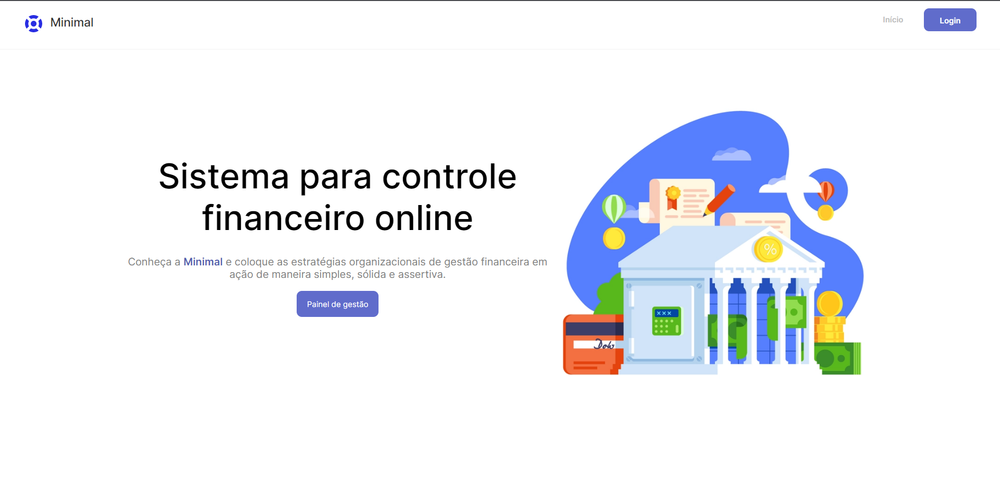
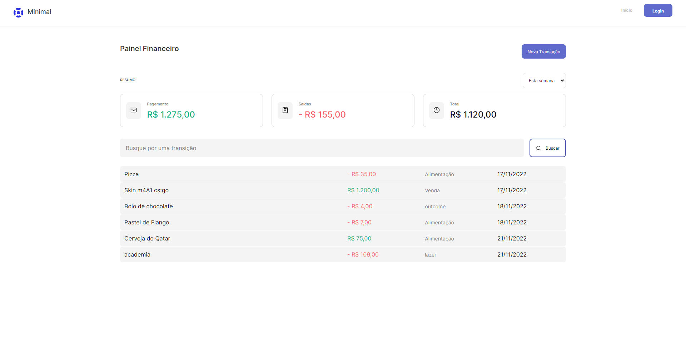
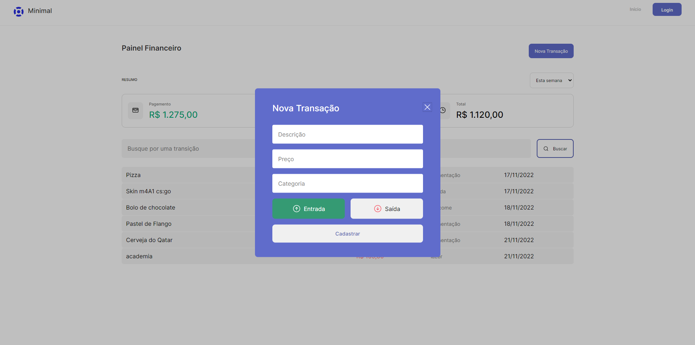

# **Minimal**: Gerenciador Financeiro Online

## **Descrição**
O Minimal é um gerenciador financeiro online pessoal para controle de gastos. Com uma interface ágil, fácil de usar e intuitiva, o projeto permite um completo controle sobre suas finanças pessoais.

## **Funcionalidades**
O Minimal oferece as seguintes funcionalidades:

* Criação de nova transação: Adicione uma nova transação informando a descrição, valor e tipo (recebimento ou gasto).
* Listagem de transações: Visualize todas as transações registradas, ordenadas por data.
* Busca de transações: Pesquise transações específicas com base em critérios como data, descrição ou tipo.
* Total de saldo: Verifique o saldo atual, considerando as transações de recebimento e gasto.
* Total de gastos: Obtenha o valor total de gastos registrados no sistema.
* Total de recebimentos: Obtenha o valor total de recebimentos registrados no sistema.

## **Tecnologias Utilizadas**
O Minimal foi desenvolvido utilizando as seguintes tecnologias:

* React
* TypeScript
* Axios
* Json-server 
* reqres
* Zod
* Radix
* React-hook-form
* React-router
* Styled-components
* Ant Design

## **Instalação**
Siga as instruções abaixo para executar o projeto localmente:

1. Certifique-se de ter o Node.js instalado em seu computador.
2. Faça o clone deste repositório para o seu ambiente local.
3. Acesse o diretório raiz do projeto através do terminal.
4. Execute o comando '__npm install__' para instalar as dependências.
5. Em um terminal separado, execute o comando '__npm run dev:server__' para iniciar o servidor JSON simulado.
6. De volta ao terminal principal, execute o comando '__npm run  dev__' para iniciar o servidor de desenvolvimento do front-end.
7. Após a execução dos passos acima, você pode acessar o Minimal em '__http://localhost:5173__'.

## **Login**
Utilize as seguintes credenciais para fazer login:

* Email: __eve.holt@reqres.in__
* Senha: __123__

## **Contribuição**
Se você deseja contribuir para o aprimoramento do Minimal, fique à vontade para abrir uma issue ou enviar um pull request.

## **Licença**
Este projeto está licenciado sob a licença MIT. Consulte o arquivo '__LICENSE__' para obter mais informações.
